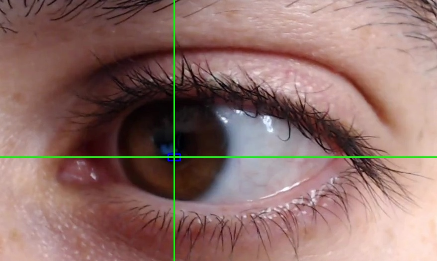

# Eye Movement Detection

## Pupil Movement



The image above shows the region of interest (ROI) for pupil movement analysis. This is an essential step in understanding and monitoring the movement of the pupils for various applications.

## Gaze Tracking


This GIF demonstrates the eye movement tracking using the GazeTracking module. The system is capable of accurately determining the user's gaze direction.

## Getting Started

To get started with eye movement detection, follow these steps:

1. Clone this repository:

   ```bash
   git clone https://github.com/your-username/eye_movement_detection.git

2. Install the necessary dependencies:
    ```bash
    pip install -r requirements.txt

3. Run the eye movement detection script:
    ```bash
    python eye_detection.py
